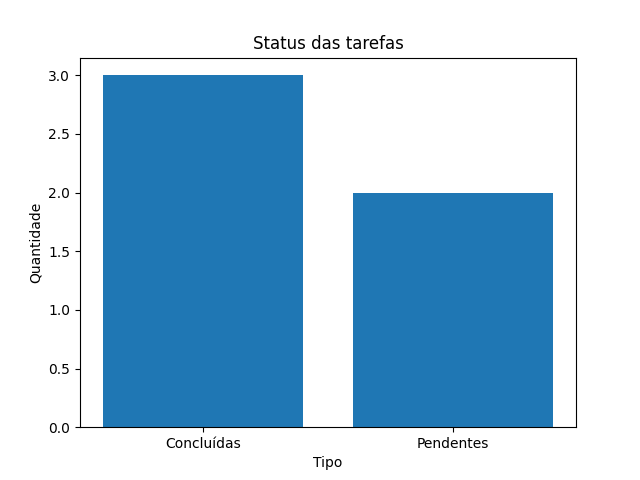

# 📋 Task Manager App 

Aplicacção desenvolvida em **Python** para gerenciamento de tarefas, com interface web utilizando **Streamlit**.

---

## 📸 Preview



---

##  🚀 Funcionalidades

- Adicionar tarefas 
- Marcar como concluídas
- Deletar tarefas 
- Persistência de dados com **JSON**
- Visualização de estatísticas
- Geração de gráficos com **matplotlib**

## 🛠️ Tecnologias utilizadas

- Python 
- Streamlit
- Matplotlib
- JSON

## ▶️ Como executar 

```bash 
pip install streamlit matplotlib 
streamlit run app.py
```
## 📑 Sobre o projeto

Este projeto foi desenvolvido com ***foco em estudo e aprendizado prático de Python***, manipulação de dados e construção de aplicações interativas. 

### ✨ Desenvolvido por *Beatriz Cordeiro* 